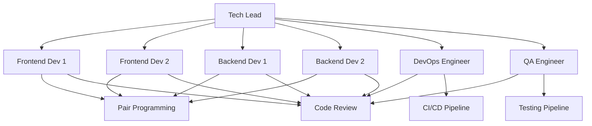

# CIN7 AI Playground - Development Workflows

## Overview

This document defines the development workflows, sprint structure, and task prioritization framework for the CIN7 AI Playground Phase 1 implementation. These workflows ensure efficient collaboration, quality delivery, and alignment with the strategic objectives.

## Team Structure and Roles

### Core Development Team (Phase 1)

```yaml
Tech Lead (1 FTE):
  - Architectural oversight and technical decisions
  - Code review and quality assurance
  - Sprint planning and coordination
  - Mentorship and knowledge sharing

Frontend Developers (2 FTE):
  - React + TypeScript implementation
  - UI/UX development with Polaris
  - Component architecture and state management
  - Responsive design and accessibility

Backend Developers (2 FTE):
  - Supabase database and Edge Functions
  - API development and authentication
  - Multi-tenant security implementation
  - Integration with external services

DevOps Engineer (1 FTE):
  - CI/CD pipeline setup and maintenance
  - Infrastructure configuration
  - Monitoring and logging implementation
  - Security and deployment procedures

QA Engineer (1 FTE - 50%):
  - Test strategy and implementation
  - Quality assurance and validation
  - Security testing and audits
  - Performance testing and monitoring
```

### Collaboration Model



## Sprint Structure and Planning

### Sprint Cadence

**Duration**: 2 weeks
**Schedule**: Monday - Sunday (14 days)
**Sprint Start**: Monday 9:00 AM team meeting
**Sprint End**: Sunday 11:59 PM
**Sprint Review**: Next Monday 10:00 AM
**Retrospective**: Next Monday 11:00 AM

### Sprint Planning Process

#### Pre-Sprint Planning (Week before sprint starts)

```yaml
Timeline:
  Monday-Wednesday: Story refinement and estimation
  Thursday: Draft sprint plan creation
  Friday: Final sprint plan review and approval

Activities:
  1. Review backlog stories and requirements
  2. Break down stories into technical tasks
  3. Estimate effort using story points
  4. Identify dependencies and risks
  5. Create sprint backlog with priorities
  6. Allocate resources and capacity planning
```

#### Sprint Planning Meeting (Monday - 2 hours)

**Agenda**:
1. **Sprint Goal Review** (15 min)
   - Review sprint objective and success criteria
   - Align with overall Phase 1 goals

2. **Capacity Planning** (15 min)
   - Team availability and capacity assessment
   - Time off and holiday considerations
   - Velocity targets and adjustment

3. **Story Review and Selection** (45 min)
   - Review prioritized stories from backlog
   - Select stories for current sprint
   - Clarify requirements and acceptance criteria

4. **Task Breakdown** (30 min)
   - Break stories into actionable tasks
   - Assign tasks to team members
   - Identify task dependencies

5. **Risk Assessment** (15 min)
   - Identify potential blockers and risks
   - Plan mitigation strategies
   - Define contingency plans

### Sprint Execution Workflow

#### Daily Standup Meeting (15 minutes - 9:30 AM daily)

**Format**: Each team member answers 3 questions:
1. What did I accomplish yesterday?
2. What will I work on today?
3. What impediments or blockers do I have?

**Standup Board**:
```yaml
In Progress:
  - Task: Implement RLS policies for projects table
  - Owner: Backend Dev 1
  - Status: In progress, 60% complete
  - Blocker: Waiting for database schema approval

Blocked:
  - Task: Create tenant management UI
  - Owner: Frontend Dev 1
  - Blocker: API endpoints not ready

Done Today:
  - Task: Set up multi-tenant database schema
  - Owner: Backend Dev 2
  - Completed: 2:30 PM

Up Next:
  - Task: Implement tenant creation API
  - Owner: Backend Dev 2
  - Priority: High
```

#### Mid-Sprint Review (End of Week 1 - 1 hour)

**Purpose**: Check sprint progress and adjust as needed

**Agenda**:
1. **Progress Review** (20 min)
   - Review completed tasks vs. sprint goal
   - Assess remaining work and capacity
   - Identify scope for adjustments

2. **Blocker Resolution** (20 min)
   - Review current blockers and impediments
   - Plan resolution strategies
   - Reallocate resources if needed

3. **Sprint Adjustments** (20 min)
   - Adjust task priorities if needed
   - Replan remaining work
   - Communicate changes to stakeholders

#### Sprint Review (Monday after sprint ends - 1 hour)

**Purpose**: Demonstrate completed work and gather feedback

**Participants**: Development team, Product Owner, stakeholders

**Agenda**:
1. **Sprint Goal Review** (10 min)
   - Review sprint objective and success criteria
   - Assess goal achievement

2. **Demo Completed Features** (30 min)
   - Demonstrate working software
   - Show user stories completed
   - Explain technical achievements

3. **Stakeholder Feedback** (15 min)
   - Gather feedback on completed work
   - Discuss business value delivered
   - Identify improvements for next sprint

4. **Metrics Review** (5 min)
   - Review sprint metrics (velocity, burndown, quality)
   - Discuss team performance

#### Sprint Retrospective (Monday after sprint review - 1 hour)

**Purpose**: Reflect on process and identify improvements

**Format**: Three-part retrospective

**What Went Well** (15 min):
- Celebrate successes and achievements
- Identify effective practices to continue
- Recognize team contributions

**What Could Be Improved** (15 min):
- Discuss challenges and pain points
- Identify process improvements
- Suggest changes for next sprint

**Action Items** (30 min):
- Create concrete action items
- Assign owners and deadlines
- Plan implementation of improvements

## Task Management and Prioritization

### Story Point Estimation

**Fibonacci Sequence**: 1, 2, 3, 5, 8, 13

**Definition of Points**:
```yaml
1 Point: Simple task (1-2 hours)
  - Well-understood requirements
  - Minimal complexity
  - Low risk
  - Example: Update existing UI component

2 Points: Moderate task (3-4 hours)
  - Clear requirements
  - Some complexity
  - Low to moderate risk
  - Example: Add new API endpoint

3 Points: Complex task (5-8 hours)
  - Some requirements uncertainty
  - Moderate complexity
  - Moderate risk
  - Example: Implement user authentication flow

5 Points: Very complex task (1-2 days)
  - Significant requirements discovery
  - High complexity
  - High risk
  - Example: Implement multi-tenant database migration

8 Points: Epic task (3-5 days)
  - Major requirements discovery
  - Very high complexity
  - Very high risk
  - Example: Complete authentication system implementation

13 Points: Research/Spikes (1 week)
  - Unknown requirements
  - Research needed
  - High uncertainty
  - Example: Evaluate real-time collaboration technologies
```

### Prioritization Framework

#### ICE Score Method

**ICE = Impact × Confidence × Ease**

**Impact (1-10)**:
- How much value does this deliver to users?
- How much does this contribute to sprint goals?
- How critical is this to the overall project?

**Confidence (1-10)**:
- How confident are we in the requirements?
- How certain are we about the technical approach?
- How much risk is involved?

**Ease (1-10)**:
- How much effort is required? (inverted scale - higher = easier)
- How complex is the implementation?
- How many dependencies are involved?

**Example Scoring**:
```yaml
Task: Implement RLS policies for projects table
Impact: 10 (Critical for security)
Confidence: 8 (Clear requirements, proven approach)
Ease: 7 (Moderate complexity, few dependencies)
ICE Score: 10 × 8 × 7 = 560

Task: Create tenant management UI
Impact: 8 (High user value)
Confidence: 9 (Clear requirements, standard patterns)
Ease: 8 (Low complexity, no dependencies)
ICE Score: 8 × 9 × 8 = 576
```

#### Sprint Prioritization Rules

1. **Sprint Goal First**: Tasks that directly contribute to sprint goal
2. **Dependencies**: Unblock other team members' work
3. **Risk Mitigation**: Address high-risk items early
4. **Quality Gates**: Ensure testing and quality requirements are met
5. **Definition of Done**: All tasks must meet DoD criteria

### Definition of Done (DoD)

#### Product DoD
```yaml
User Story Completion:
  - All acceptance criteria met
  - User testing completed
  - Product owner acceptance
  - Documentation updated

Quality Requirements:
  - Code review completed and approved
  - Unit tests written and passing
  - Integration tests completed
  - Security review completed (if applicable)
  - Performance requirements met

Release Readiness:
  - Feature flagged for production release
  - User documentation updated
  - Release notes prepared
  - Stakeholder communication completed
```

#### Technical DoD
```yaml
Code Quality:
  - Code follows team coding standards
  - TypeScript types are properly defined
  - ESLint rules passing with no warnings
  - Prettier formatting applied
  - Code comments explain complex logic

Testing Requirements:
  - Unit test coverage > 80%
  - All tests passing
  - Integration tests completed
  - Manual testing completed
  - Cross-browser testing completed

Security and Performance:
  - Security requirements implemented
  - Performance benchmarks met
  - Accessibility standards met (WCAG 2.1 AA)
  - Error handling implemented
  - Logging and monitoring added
```

## Code Review Process

### Pull Request Workflow

#### Branch Naming Convention
```yaml
Feature Branches: feature/story-number-short-description
  Example: feature/1.1-tenant-database-schema

Bugfix Branches: bugfix/description-of-issue
  Example: bugfix/fix-rls-policy-issue

Hotfix Branches: hotfix/critical-fix-description
  Example: hotfix/security-vulnerability-fix

Release Branches: release/version-number
  Example: release/v1.0.0
```

#### Pull Request Template
```markdown
## Description
Brief description of changes made and why they are needed.

## Type of Change
- [ ] Bug fix (non-breaking change that fixes an issue)
- [ ] New feature (non-breaking change that adds functionality)
- [ ] Breaking change (fix or feature that would cause existing functionality to not work as expected)
- [ ] Documentation update

## Testing
- [ ] Unit tests added/updated
- [ ] Integration tests added/updated
- [ ] Manual testing completed
- [ ] Cross-browser testing completed

## Security and Performance
- [ ] Security implications considered
- [ ] Performance impact assessed
- [ ] Database migrations tested
- [ ] Error handling implemented

## Checklist
- [ ] My code follows the style guidelines of this project
- [ ] I have performed a self-review of my own code
- [ ] I have commented my code, particularly in hard-to-understand areas
- [ ] I have made corresponding changes to the documentation
- [ ] My changes generate no new warnings
- [ ] Any dependent changes have been merged and published

## Related Issues
Closes #(issue number)
```

#### Code Review Guidelines

**Reviewers**:
- At least one team member must review
- Tech Lead review required for complex changes
- QA review required for user-facing features

**Review Criteria**:
```yaml
Functionality:
  - Does the code work as intended?
  - Are all requirements met?
  - Are edge cases handled?

Code Quality:
  - Is the code readable and maintainable?
  - Are variable and function names descriptive?
  - Is the code well-organized?

Performance:
  - Are there any performance bottlenecks?
  - Are database queries optimized?
  - Is memory usage appropriate?

Security:
  - Are there any security vulnerabilities?
  - Is input validation implemented?
  - Are authentication/authorization checks in place?

Testing:
  - Are tests comprehensive?
  - Do tests cover edge cases?
  - Are tests maintainable?
```

#### Review Process Timeline

```yaml
Initial Review: Within 4 business hours of PR creation
  - Automated checks run
  - Initial human review started

Author Response: Within 8 business hours of review comments
  - Address all review comments
  - Update code as needed
  - Respond to all feedback

Final Review: Within 4 business hours of author response
  - Review changes made
  - Approve or request additional changes

Merge: Within 2 business hours of final approval
  - Ensure CI/CD checks pass
  - Merge to main branch
  - Delete feature branch
```

## Quality Assurance Process

### Testing Strategy

#### Test Pyramid
```
    E2E Tests (10%)
   ┌─────────────────┐
  │   Critical User  │
 │     Workflows     │
│─────────────────────────│
│  Integration Tests (30%) │
│   API Endpoints          │
│  Database Integration    │
│ Component Integration    │
├─────────────────────────┤
│   Unit Tests (60%)       │
│  Utility Functions       │
│   Service Logic          │
│  Component Behavior      │
│  Business Logic          │
└─────────────────────────┘
```

#### Test Coverage Requirements
```yaml
Unit Tests:
  - Target: 90%+ coverage
  - Required for: All new code
  - Tools: Vitest + React Testing Library
  - Focus: Business logic, utilities, services

Integration Tests:
  - Target: 80%+ coverage
  - Required for: API endpoints, database operations
  - Tools: Supabase test utilities
  - Focus: Data flow, external integrations

E2E Tests:
  - Target: Critical paths only
  - Required for: User workflows, key features
  - Tools: Playwright
  - Focus: User experience, cross-browser compatibility
```

#### Quality Gates

#### Pre-commit Checks
```yaml
Required Checks:
  - ESLint: No warnings or errors
  - Prettier: Code formatting
  - TypeScript: Type checking
  - Unit tests: 100% passing

Failed Check Actions:
  - Block commit if checks fail
  - Show clear error messages
  - Provide fix suggestions
```

#### Continuous Integration Checks
```yaml
Required for Merge:
  - All tests passing (unit, integration, E2E)
  - Code coverage > 80%
  - Security scan: No critical vulnerabilities
  - Performance: No regressions
  - Build: Successful compilation

Optional Checks:
  - Accessibility audit (aXe)
  - Bundle size analysis
  - Documentation generation
```

## Risk Management

### Risk Identification Process

#### Weekly Risk Assessment
```yaml
Timeline: Every Friday afternoon
Participants: Tech Lead, Senior Developers

Process:
  1. Review current sprint risks
  2. Identify new risks from past week
  3. Assess risk impact and probability
  4. Update risk register
  5. Plan mitigation strategies
```

#### Risk Categories

**Technical Risks**:
```yaml
Database Complexity:
  Risk: Multi-tenant RLS implementation challenges
  Impact: High
  Probability: Medium
  Mitigation: Early prototyping, expert consultation

Performance Issues:
  Risk: Query performance degradation with RLS
  Impact: Medium
  Probability: Medium
  Mitigation: Indexing strategy, performance monitoring

Integration Complexity:
  Risk: Third-party service integration issues
  Impact: Medium
  Probability: High
  Mitigation: Fallback implementations, thorough testing
```

**Project Risks**:
```yaml
Timeline Delays:
  Risk: Technical complexity causing delays
  Impact: Medium
  Probability: Medium
  Mitigation: Buffer time, scope flexibility

Team Skill Gaps:
  Risk: Team unfamiliar with multi-tenant architecture
  Impact: Medium
  Probability: Low
  Mitigation: Training, external consultants, documentation

Requirement Changes:
  Risk: Changing requirements mid-sprint
  Impact: Medium
  Probability: Low
  Mitigation: Clear requirements process, change control
```

### Risk Response Planning

#### Risk Register Template
```yaml
Risk ID: RISK-001
Risk Description: Multi-tenant RLS policy complexity
Category: Technical
Impact: High (3)
Probability: Medium (2)
Risk Score: 6

Mitigation Strategy:
  - Early implementation of simple RLS policies
  - Database security expert consultation
  - Comprehensive testing of isolation

Contingency Plan:
  - Simplified tenant isolation if needed
  - Additional time allocation in sprint
  - External consultant engagement

Owner: Backend Dev 1
Review Date: 2025-10-22
Status: Active
```

## Communication and Collaboration

### Meeting Cadence

#### Regular Meetings
```yaml
Daily Standup: 15 minutes - 9:30 AM daily
  - Purpose: Progress sync and blocker identification
  - Participants: Entire development team
  - Format: In-person or video call

Sprint Planning: 2 hours - Every other Monday
  - Purpose: Plan upcoming sprint work
  - Participants: Development team, Product Owner
  - Format: In-person workshop

Sprint Review: 1 hour - Every other Monday
  - Purpose: Demonstrate completed work
  - Participants: Development team, stakeholders
  - Format: Presentation and demo

Sprint Retrospective: 1 hour - Every other Monday
  - Purpose: Process improvement
  - Participants: Development team
  - Format: Facilitated discussion

Technical Review: 1 hour - Bi-weekly
  - Purpose: Technical decisions and architecture
  - Participants: Tech Lead, Senior Developers
  - Format: Technical discussion

QA Planning: 30 minutes - Weekly
  - Purpose: Test planning and quality coordination
  - Participants: QA Engineer, Tech Lead
  - Format: Planning session
```

#### Communication Channels

```yaml
Slack Channels:
  #cin7-ai-dev: General development discussion
  #cin7-ai-tech: Technical decisions and architecture
  #cin7-ai-qa: Testing and quality assurance
  #cin7-ai-alerts: System alerts and incidents
  #cin7-ai-releases: Deployment and release communications

Documentation:
  - Confluence for project documentation
  - GitHub for code and technical docs
  - Figma for design specifications
  - Miro for collaborative planning

Issue Tracking:
  - GitHub Issues for bugs and features
  - GitHub Projects for sprint management
  - Jira for project management (if needed)
```

### Documentation Standards

#### Code Documentation
```yaml
Required Documentation:
  - README.md for each major component
  - API documentation for all endpoints
  - Database schema documentation
  - Deployment procedures
  - Troubleshooting guides

Documentation Quality:
  - Clear and concise language
  - Examples and code snippets
  - Diagrams for complex concepts
  - Regular updates and maintenance
```

#### Meeting Documentation
```yaml
Meeting Notes:
  - Decisions made and action items
  - Assigned owners and deadlines
  - Key discussion points
  - Follow-up requirements

Distribution:
  - Shared in relevant Slack channels
  - Stored in project documentation
  - Action items tracked in project management tool
```

## Performance Metrics and KPIs

### Sprint Metrics

```yaml
Velocity:
  - Definition: Story points completed per sprint
  - Target: 21-25 points per sprint
  - Measurement: End of each sprint
  - Trend: Track over multiple sprints

Burndown Chart:
  - Definition: Work remaining vs. time
  - Target: Consistent burndown pattern
  - Measurement: Daily tracking
  - Alert: Flag if falling behind

Sprint Goal Success:
  - Definition: Percentage of sprint goals achieved
  - Target: 90%+
  - Measurement: Sprint review
  - Trend: Track consistency
```

### Quality Metrics

```yaml
Code Quality:
  - Test Coverage: Target 80%+
  - Code Review: 100% coverage
  - Security: 0 critical vulnerabilities
  - Performance: No regressions

Defect Metrics:
  - Defect Density: <1 per 1000 lines
  - Defect Removal Efficiency: >95%
  - Escaped Defects: <5% of total
  - Mean Time to Resolution: <24 hours
```

### Team Metrics

```yaml
Productivity:
  - Throughput: Stories completed per sprint
  - Cycle Time: Time from start to completion
  - Lead Time: Time from backlog to deployment
  - Deployment Frequency: Target weekly

Collaboration:
  - Code Review Participation: 100% involvement
  - Knowledge Sharing: Regular sessions
  - Cross-functional Work: Encouraged
  - Team Satisfaction: Regular surveys
```

## Continuous Improvement

### Process Improvement Framework

#### Plan-Do-Check-Act (PDCA) Cycle
```yaml
Plan:
  - Identify improvement opportunities
  - Set clear improvement goals
  - Plan implementation strategy
  - Define success metrics

Do:
  - Implement improvements
  - Document changes
  - Train team on new processes
  - Monitor implementation

Check:
  - Measure improvement effectiveness
  - Collect feedback from team
  - Review metrics and KPIs
  - Assess goal achievement

Act:
  - Standardize successful improvements
  - Adjust or abandon unsuccessful changes
  - Plan next improvement cycle
  - Share learnings with organization
```

#### Retrospective Action Items
```yaml
Format:
  - Specific action items from retrospectives
  - Clear owners and deadlines
  - Measurable success criteria
  - Regular follow-up and tracking

Example Actions:
  - "Improve code review turnaround time to <24 hours"
    Owner: Tech Lead
    Deadline: Next sprint
    Success: All PRs reviewed within 24 hours

  - "Add integration tests for all new API endpoints"
    Owner: QA Engineer
    Deadline: 2 sprints
    Success: 100% API coverage achieved
```

### Knowledge Management

#### Documentation Strategy
```yaml
Living Documentation:
  - Regular updates and maintenance
  - Version control for all documents
  - Clear ownership and review process
  - Searchable and accessible

Knowledge Sharing:
  - Regular tech talks and presentations
  - Pair programming sessions
  - Code review discussions
  - Architecture decision records (ADRs)
```

#### Onboarding Process
```yaml
New Team Member Onboarding:
  - Comprehensive documentation package
  - Assigned mentor/buddy
  - Structured learning plan
  - Regular check-ins and feedback

Knowledge Transfer:
  - Regular brown-bag sessions
  - Documentation of tribal knowledge
  - Cross-training initiatives
  - Succession planning for key roles
```

---

This comprehensive development workflow document provides the foundation for successful Phase 1 implementation. The workflows ensure efficient collaboration, quality delivery, and continuous improvement throughout the development process.

The next step is to create the comprehensive development timeline and GitHub project structure to support these workflows.